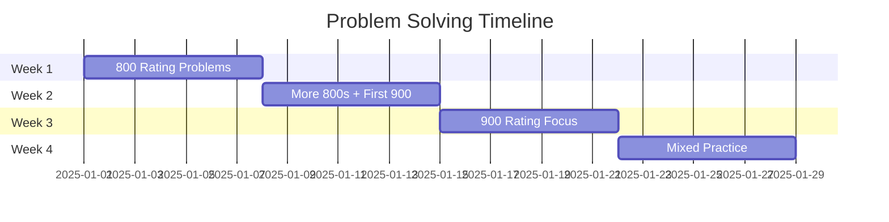

<div align="center">

# 🚀 Codeforces Grind with Java


</div>

---

<p align="center">
  
</p>

---

## 📊 Daily Progress

| Date       | Problems Solved | Streak    | Current Rating  |
| ---------- | --------------- | --------- | --------------- |
| 2025-08-03 | 2 ✅             | 🔥 2 Days | 🟢 Newbie (800) |
| 2025-08-02 | 1 ✅             |           |                 |

*Last updated: <!--LAST_UPDATED-->*

---

## 📚 Learning Roadmap

### 📚 Phase 1: Foundation Building (800-900)

* [x] Basic I/O and implementation
* [ ] Mathematical operations and formulas
* [ ] String manipulation techniques
* [ ] Array and basic data structure problems
* [ ] Greedy algorithm fundamentals

### 🧐 Phase 2: Skill Development (1000-1200)

* [ ] Advanced greedy strategies
* [ ] Basic graph algorithms (BFS/DFS)
* [ ] Dynamic programming introduction
* [ ] Number theory concepts
* [ ] Combinatorics basics

### 🚀 Phase 3: Mastery (1300+)

* [ ] Complex DP patterns
* [ ] Advanced graph algorithms
* [ ] Tree algorithms
* [ ] Segment trees and data structures
* [ ] Game theory and mathematical proofs

---

## 📆 Weekly Sprint Goals



---

## 📊 Last 5 Solved Problems

| # | Title                                                       | Rating | Verdict    | Time             |
| - | ----------------------------------------------------------- | ------ | ---------- | ---------------- |
| 1 | [Watermelon](https://codeforces.com/problemset/problem/4/A) | 800    | ✅ Accepted | 2025-08-03 09:15 |
| 2 | [Word](https://codeforces.com/problemset/problem/59/A)      | 800    | ✅ Accepted | 2025-08-02 22:41 |

<!-- Auto-updated section ends here -->

---

## 📅 Problem Categories

<details>
<summary>📁 <strong>800 Rated</strong></summary>

| Problem            | Code                                                  | Notes              |
| ------------------ | ----------------------------------------------------- | ------------------ |
| Watermelon         | [solution.java](./800-rated/watermelon/Solution.java) | Simple math check  |
| Way Too Long Words | [solution.java](./800-rated/long-words/Solution.java) | String compression |

</details>

<details>
<summary>🔢 <strong>Math</strong></summary>

| Problem        | Code | Notes |
| -------------- | ---- | ----- |
| Coming soon... | -    | -     |

</details>

<details>
<summary>🌟 <strong>Greedy</strong></summary>

| Problem        | Code | Notes |
| -------------- | ---- | ----- |
| Coming soon... | -    | -     |

</details>

---

## 📂 Repository Structure

```
Codeforces/
├── 📁 800-rated/
│   ├── problem-A/
│   │   ├── solution.java
│   │   ├── input.txt
│   │   └── README.md
│   └── problem-B/
├── 📁 900-rated/
├── 📁 1000-rated/
├── 📁 contest-solutions/
├── 📁 templates/
├── 📊 progress.md
└── 📚 resources.md
```

---

## 🚀 Motivation Zone

> *"Consistency beats perfection. Progress beats procrastination."*

> *"Every problem solved is a step closer to mastery."*

> *"The journey of a thousand algorithms begins with a single solution."*

```java
if (today == challenging) {
    keep_solving();
    learn_from_mistakes();
    celebrate_small_wins();
}
```

---

## 👥 Connect with Me

<div align="center">

[](https://codeforces.com/profile/patilmadhuram)
[](https://linkedin.com/in/madhurampatil)
[](https://github.com/patilmadhuram)

</div>

---

<div align="center">

### ⭐ Support This Journey

[](https://github.com/patilmadhuram/Codeforces)
[](https://github.com/patilmadhuram/Codeforces/fork)
[](https://github.com/patilmadhuram/Codeforces/subscription)

---

<sub>Auto-updated using GitHub Actions | Made with ❤️ + ☕ + Java</sub>


</div>
