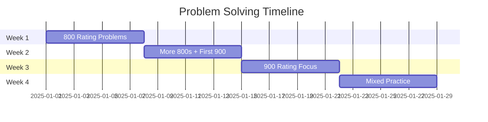

# 🚀 Codeforces Problem Solving Journey

<div align="center">


</div>

---

## 🎯 Mission Statement

<div align="center">

</div>

Welcome to my **competitive programming odyssey**! 🌟 This repository documents my systematic journey through Codeforces problems, starting from 800-rated challenges and progressively conquering higher difficulties.

> 💫 **Philosophy**: *Every expert was once a beginner. Every pro was once an amateur.*

---

## 🛠️ Tech Arsenal

<div align="center">

| Category | Tool | Purpose |
|----------|------|---------|
| 💻 **Language** | Java 21 | Primary programming language |
| 🔧 **IDE** | IntelliJ IDEA | Development environment |
| ⚡ **Testing** | Custom Runner | Automated test validation |
| 📊 **Tracking** | Excel + GitHub | Progress monitoring |

</div>

### ⚡ Quick Start

```bash
# Clone the repository
git clone https://github.com/patilmadhuram/Codeforces.git
cd Codeforces

# Compile and run (example)
javac Solution.java
java Solution < input.txt
```

---

## 📊 Progress Dashboard

<div align="center">

### 🏆 Current Stats


</div>

| Difficulty | Problems Solved | Success Rate | Next Target |
|------------|----------------|--------------|-------------|
| 🟢 **800** | 1/20 | 100% | Master basics |
| 🟡 **900** | 0/15 | - | Implementation |
| 🟠 **1000** | 0/10 | - | Greedy + Math |
| 🔴 **1100+** | 0/5 | - | Advanced topics |

---

## 🎯 Learning Roadmap

### 📚 Phase 1: Foundation Building (800-900)
- [x] Basic I/O and implementation 
- [ ] Mathematical operations and formulas
- [ ] String manipulation techniques
- [ ] Array and basic data structure problems
- [ ] Greedy algorithm fundamentals

### 🧠 Phase 2: Skill Development (1000-1200)
- [ ] Advanced greedy strategies
- [ ] Basic graph algorithms (BFS/DFS)
- [ ] Dynamic programming introduction
- [ ] Number theory concepts
- [ ] Combinatorics basics

### 🚀 Phase 3: Mastery (1300+)
- [ ] Complex DP patterns
- [ ] Advanced graph algorithms
- [ ] Tree algorithms
- [ ] Segment trees and data structures
- [ ] Game theory and mathematical proofs

---

## 📅 Weekly Sprint Goals

<div align="center">



</div>

- **🎯 Week 1**: Master 5 problems (800 rating) - *Build confidence*
- **🎯 Week 2**: Solve 10 problems (800 rating) - *Pattern recognition*  
- **🎯 Week 3**: Tackle first 900-rated challenges - *Level up*
- **🎯 Week 4**: Mixed practice and contest participation - *Apply skills*

---

## 🏅 Problem Categories & Progress

<details>
<summary>📁 <strong>Implementation Problems</strong></summary>

| Problem | Rating | Status | Key Concepts |
|---------|--------|--------|--------------|
| [Problem A](link) | 800 | ✅ | Basic I/O, Math |
| [Problem B](link) | 800 | ⏳ | Arrays, Loops |
| [Problem C](link) | 900 | ❌ | String manipulation |

</details>

<details>
<summary>🧮 <strong>Mathematical Problems</strong></summary>

| Problem | Rating | Status | Key Concepts |
|---------|--------|--------|--------------|
| Coming Soon... | - | - | - |

</details>

<details>
<summary>🎯 <strong>Greedy Algorithms</strong></summary>

| Problem | Rating | Status | Key Concepts |
|---------|--------|--------|--------------|
| Coming Soon... | - | - | - |

</details>

---

## 💡 Key Learnings & Insights

### 🧠 Problem-Solving Strategies
- **📖 Read Carefully**: Understanding the problem is 50% of the solution
- **✏️ Work Examples**: Trace through given test cases manually
- **🎯 Start Simple**: Begin with brute force, then optimize
- **🔍 Edge Cases**: Always consider boundary conditions

### 📝 Code Quality Principles
- Clean, readable variable names
- Modular function design
- Comprehensive comments
- Efficient time/space complexity

---

## 🌟 Achievements & Milestones

<div align="center">

### 🏆 Badges Earned


</div>

---

## 🤝 Connect & Collaborate

<div align="center">

[](https://codeforces.com/profile/patilmadhuram)
[](https://linkedin.com/in/madhurampatil)
[](https://github.com/patilmadhuram)

</div>

### 💬 Let's Connect!
- 🤝 **Collaborate** on practice problems
- 💡 **Share** problem-solving strategies  
- 🎯 **Participate** in virtual contests together
- 📚 **Exchange** learning resources

---

## 🎨 Repository Structure

```
Codeforces/
├── 📁 800-rated/           # Beginner problems
│   ├── problem-A/
│   │   ├── solution.java
│   │   ├── input.txt
│   │   └── README.md
│   └── problem-B/
├── 📁 900-rated/           # Intermediate problems  
├── 📁 1000-rated/          # Advanced problems
├── 📁 contest-solutions/   # Live contest submissions
├── 📁 templates/           # Code templates & snippets
├── 📊 progress.md          # Detailed progress tracking
└── 📚 resources.md         # Learning materials & links
```

---

## 🔥 Motivation Zone

<div align="center">

### 💪 Daily Affirmations
> *"Consistency beats perfection. Progress beats procrastination."*

> *"Every problem solved is a step closer to mastery."*

> *"The journey of a thousand algorithms begins with a single solution."*


</div>

### 🎯 Personal Commitment
```
if (today == challenging) {
    keep_solving();
    learn_from_mistakes();
    celebrate_small_wins();
}
```

---

## 📚 Resources & References

<details>
<summary>📖 <strong>Learning Materials</strong></summary>

- 📘 **Books**: "Competitive Programming 4" by Steven Halim
- 🎥 **YouTube**: Errichto, William Lin, SecondThread
- 💻 **Practice**: Codeforces, AtCoder, LeetCode
- 📝 **Blogs**: CP-Algorithms, GeeksforGeeks

</details>

<details>
<summary>🛠️ <strong>Tools & Extensions</strong></summary>

- **CF Predictor**: Rating change predictions
- **Codeforces Visualizer**: Problem difficulty graphs  
- **Competitive Companion**: Browser extension for parsing
- **CF Analytics**: Performance tracking tools

</details>

---

<div align="center">

## ⭐ Support This Journey

If this repository inspires your competitive programming journey:

[](https://github.com/patilmadhuram/Codeforces)
[](https://github.com/patilmadhuram/Codeforces/fork)
[](https://github.com/patilmadhuram/Codeforces/subscription)

---

<sub>🚀 **Last Updated**: January 2025 | Made with ❤️, ☕, and endless determination</sub>


</div>
